# Real-Time Embedded Systems

This repository contains the assignments for the Academic Courses "Real-Time Embedded Systems" taught in the Spring of 2019-2020 in Electrical and Computer Engineering Department of Aristotle University of Thessaloniki.

The purpose of this project is the familiarization with **pthreads** library of **C** through the development a **producer-consumer** variant. The work is divided into two deliverables, which are responsible for optimizing the number of consumer threads to minimize in-queue time of each item and creating a timer to execute items under a specific frequency. 

At the end, the source code will be compiled on a **Raspberry-Pi** and the experiments will take place Real-Time in the campus area.

    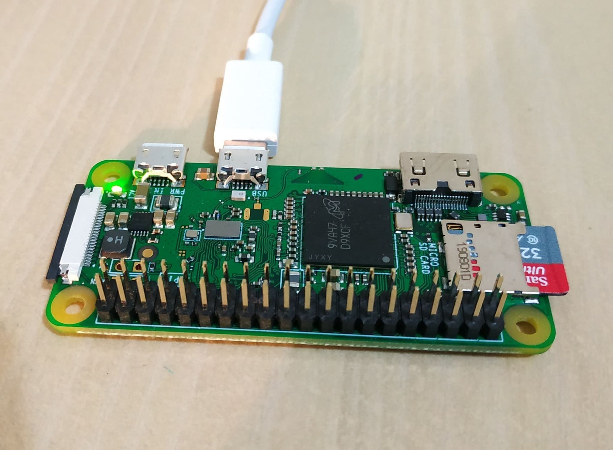

---

### 1.1. Average Time in Queue ~ Number of Consumer Threads

This report analyzes the implementation of a **FIFO circular queue**, which contains pointers to functions and arguments, as a variation of the **producer-consumer problem**, using **pthreads**, as well as the results of measuring the time each item remains in the queue. A list of pointers to functions and pointers to arguments has been created, as global variables for each thread to access, which make a simple printout or calculate a mathematical function. The main function generates P threads of producers and Q threads of consumers and displays the average time that an item is stored in the queue from the time a producer places it until a consumer receives it. The producer randomly selects a function and an argument and places them in the queue. The consumer receives the first element of the queue, counts the time and executes it. At this point the mechanism of termination of these threads must be understood. This is done by receiving in consumer a pointer to NULL from the queue. When a consumer reads it, he puts it back in queue for the next one and terminates. 

The aim is to find the number of consumer threads that minimizes the above statistics. The number of producers is constant and equal to 1, while the number of LOOP iterations of the producer was set to 10,000, in order to extract secure statistical data. Finally, the queue size was set equal to 10, as the consumption rate is higher than the production rate and therefore it is rare for the buffer to fill up. Before analyzing the applied methodology it should be mentioned that for the execution of the program a processor consisting of 4 physical cores was used, each of which can run simultaneously as 2 threads, ie 8 logical cores, in case there is no waiting for input -exit. Because the functions we used include printing, the optimal number of consumer threads will be more than 8, as the processor will schedule new tasks during the input-output process in order to increase its efficiency.

### 1.2. Results

Finding the minimum average in-queue time requires performing the experiment on different numbers of consumer threads (Q = 2,4,6,…, 60). The following graph made with the help of MATLAB illustrates the average value of the in-queue time, depending on the number of consumers.

    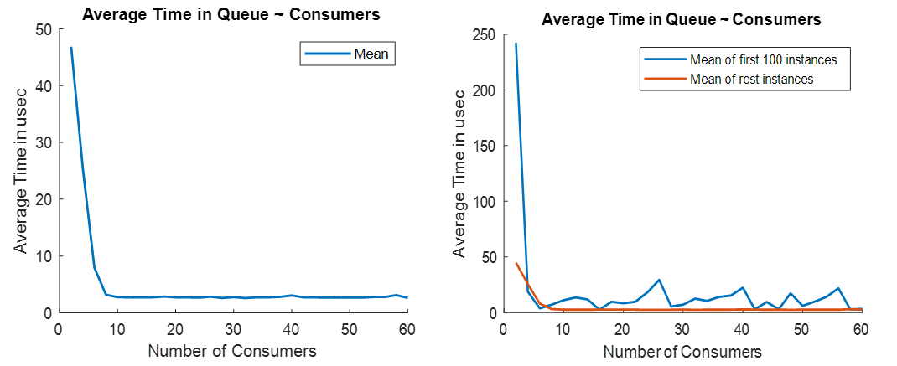

| **Cons** | **Mean** | **St. Dev** | **Median** | **Min** | **Max** |      | **Cons** | **Mean** | **St. Dev** | **Median** | **Min** | **Max** |
| -------- | -------- | ----------- | ---------- | ------- | ------- | ---- | -------- | -------- | ----------- | ---------- | ------- | ------- |
| 2        | 46.858   | 43.452      | 37         | 0       | 647     |      | 32       | 2.5864   | 2.5356      | 3          | 0       | 64      |
| 4        | 25.527   | 93.333      | 18         | 0       | 2917    |      | 34       | 2.708    | 2.6204      | 3          | 0       | 62      |
| 6        | 7.938    | 13.384      | 3          | 0       | 160     |      | 36       | 2.7109   | 2.5281      | 3          | 0       | 48      |
| 8        | 3.1719   | 6.0669      | 3          | 0       | 376     |      | 38       | 2.8011   | 5.187       | 3          | 0       | 373     |
| 10       | 2.7379   | 3.097       | 3          | 0       | 78      |      | 40       | 3.0537   | 4.9934      | 3          | 0       | 178     |
| 12       | 2.7147   | 3.0211      | 3          | 0       | 95      |      | 42       | 2.7137   | 2.8796      | 3          | 0       | 71      |
| 14       | 2.7125   | 4.7912      | 3          | 0       | 407     |      | 44       | 2.6964   | 2.3052      | 3          | 0       | 52      |
| 16       | 2.7189   | 2.1984      | 3          | 0       | 74      |      | 46       | 2.6648   | 2.2114      | 3          | 0       | 133     |
| 18       | 2.8442   | 5.9883      | 3          | 0       | 483     |      | 48       | 2.6944   | 3.1094      | 3          | 0       | 80      |
| 20       | 2.7155   | 2.2759      | 3          | 0       | 45      |      | 50       | 2.6562   | 1.9723      | 3          | 0       | 42      |
| 22       | 2.7105   | 2.8008      | 3          | 0       | 93      |      | 52       | 2.6614   | 2.5789      | 3          | 0       | 57      |
| 24       | 2.6584   | 2.8906      | 3          | 0       | 62      |      | 54       | 2.7677   | 3.1054      | 3          | 0       | 78      |
| 26       | 2.8305   | 4.471       | 3          | 0       | 96      |      | 56       | 2.7671   | 3.1409      | 3          | 0       | 65      |
| 28       | 2.6019   | 2.3088      | 3          | 0       | 87      |      | 58       | 3.0997   | 36.532      | 3          | 0       | 3467    |
| 30       | 2.7483   | 2.4794      | 3          | 0       | 58      |      | 60       | 2.6348   | 1.8056      | 3          | 0       | 42      |

From the above it can be concluded that from one point onwards the increase in consumers does not significantly contribute to the reduction of the average waiting time. Therefore, by choosing a point near the "knee" of the curve, satisfactory results are achieved. This could be the 16 consumers, with whom a small standard deviation is achieved.

### 2.1. Timer and Time Drift correction

In this section, the producer thread places an item in the queue every **Period** seconds, which is achieved through *usleep*. Due to the time needed by other tasks of a producer, it should never sleep for *Period* seconds, but for a variable time, depending on the previous Period. This Period correction is called **Time Drift correction**.

As can be easily understood by observing the code, the producer has to perform some other tasks before placing an item in the queue, from the moment it wakes up, such as checking if the queue is full. Therefore, the argument of usleep should not be exactly the same as the period. The mechanism used is as follows: before a producer is put into inactivity via `usleep`, it is checked how much time has passed since the previous time it was at the same point in the code, ie how much time it has finally taken since it was inactive the previous time. This time is slightly different from the period for the reasons mentioned. This difference is called **timedrift**, it can be either positive or negative and must be subtracted from the total hibernation time for each period so that we do not have a time charge. The goal is to have an average value close to 0, so that the execution of the program for a long time does not deviate from the expected time.

### 2.2. Simulations

As requested, **four experiments** were performed. Specifically, three individual experiments were performed for timers with periods of **1 sec, 0.1 sec, 0.01 sec** and one where all **3 timers running simultaneously**. All experiments executed on **Raspberry-Pi Zero**. 

For each timer, a producer thread is created, while a total of **10 consumer threads** were used since this number produced satisfactory results, according to the previous deliverable. It is obvious that each *TimerFcn* running periodically should not be longer in duration than the period.

In addition, the more producers there are, the longer a job will stay in the queue, as consumers will not be able to get it out in time.
Appropriate timestamps were used in each experiment to measure **two time values**:

-  The set time of the producer period to put an item in the queue (ie the difference of the time it takes a producer to be at the same point in the code, from the previous time he put an item in the queue) from the expected period time .
- The time that an item stays in the queue, from the moment the producer places it until the consumer exports it.

#### 2.2.1. Timer with Period 1 sec

    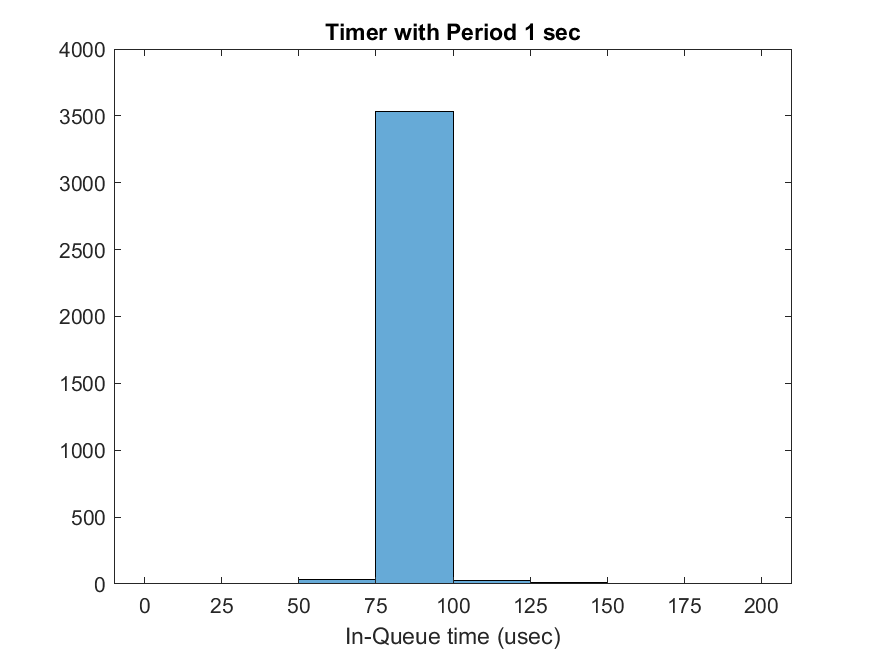 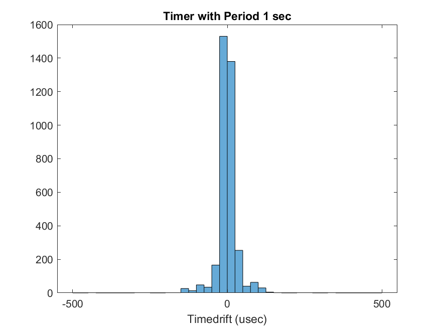

- **Stay-in time of a queue job**: the average value is 83.34 μsec, the median value 84 μsec, the standard deviation 7.98, the minimum value 54 μsec and the maximum 365 μsec.
- **Producer time correction (timedrift)**: the average value is 0.11 μsec, the median value -1 μsec, the standard deviation 44.29, the minimum value -1102 μsec and the maximum 1468 μsec.
- **Processor usage** is ~ 0.0436% and the program ran for 3600.006201 sec.

    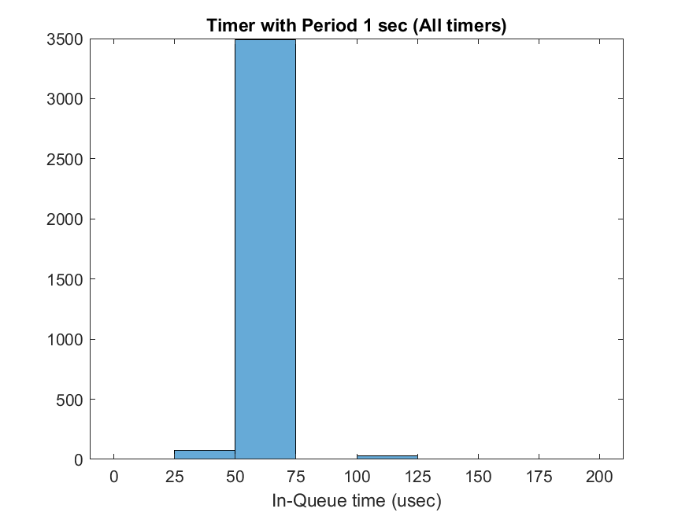 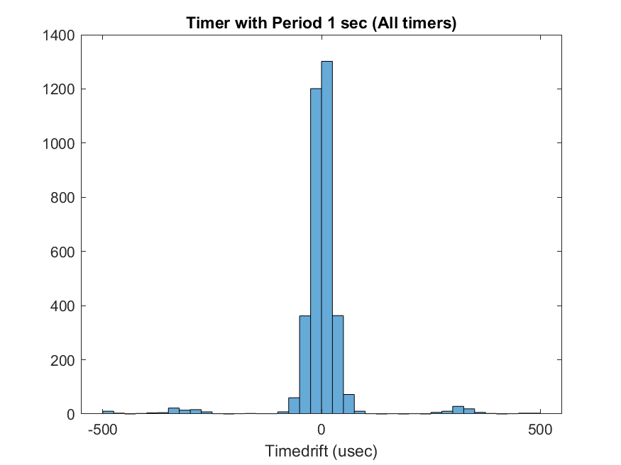

In the **simultaneous execution** of the timer with a period of 1 sec, the following statistics were measured:

- **Stay-in time of a queue job**: the average value is 64.93 μsec, the median value 65 μsec, the standard deviation 8.85, the minimum value 41 μsec and the maximum 349 μsec.
- **Producer time correction (timedrift)**: the average value is 0.22 μsec, the median value is 0 μsec, the standard deviation is 101.43, the minimum value is -754 μsec and the maximum is 895 μsec.

---

#### 2.2.2. Timer with Period 0.1 sec

    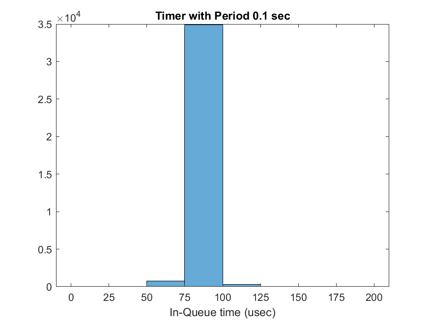 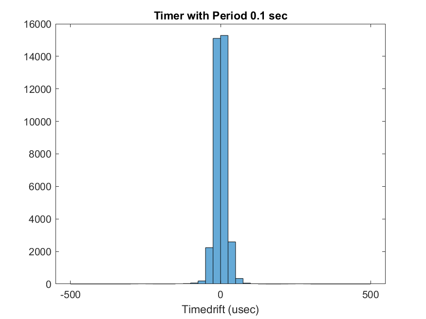

- **Stay-in time of a queue job**: the mean is 83.22 μsec, the median is 83 μsec, the standard deviation is 9.05, the minimum is 52 μsec and the maximum is 376 μsec.
- **Producer time correction (timedrift)**: the mean value is 0.01 μsec, the mean 0 μsec, the standard deviation 25.95, the minimum value -1746 μsec and the maximum 1534 μsec.
- **Processor usage** is ~ 0.43% and the program ran for 3600.006306 sec.

    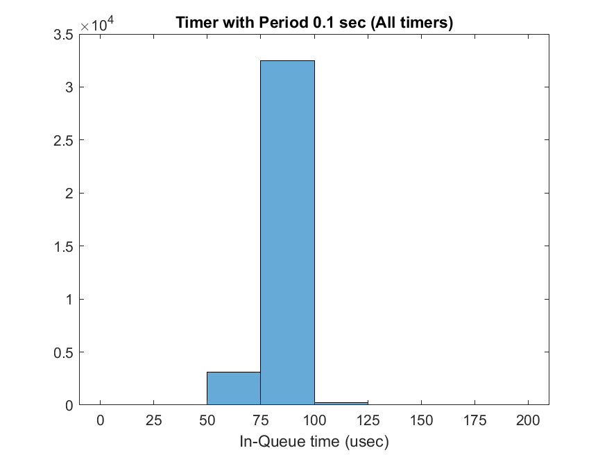 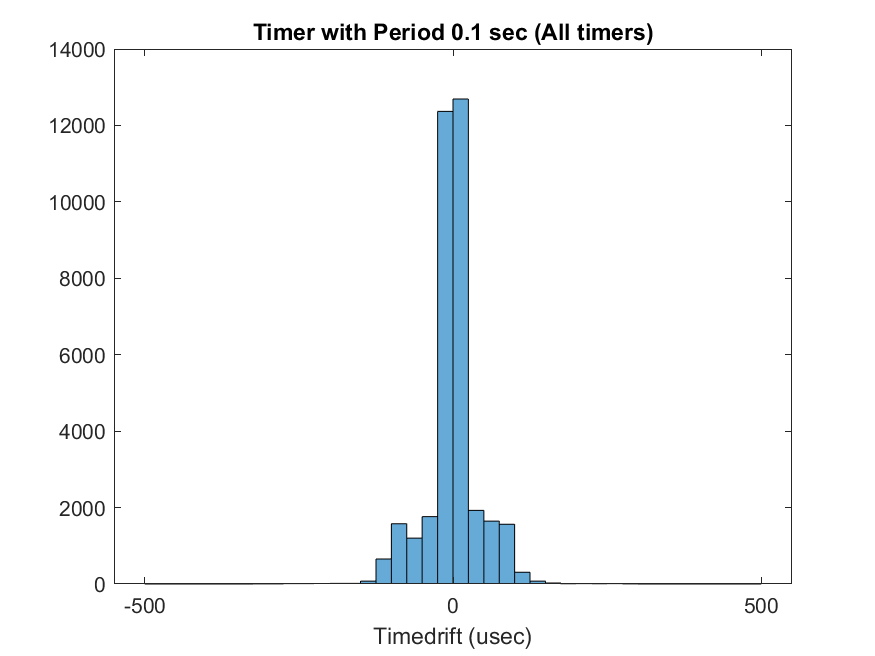

In the **simultaneous execution** of the timer with a period of 0.1 sec, the following statistics were measured:

- **Stay-in time of a queue job**: the average value is 79.78 μsec, the median 80 μsec, the standard deviation 11.00, the minimum value 53 μsec and the maximum 650 μsec.
- **Producer time correction (timedrift)**: the mean value is 0.01 μsec, the median 1 μsec, the standard deviation 78.48, the minimum value -5284 μsec and the maximum 5359 μsec.

---

#### 2.2.3. Timer with Period 0.01 sec

    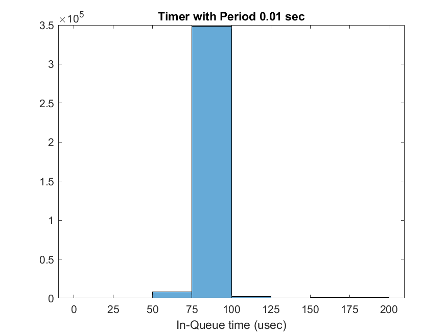 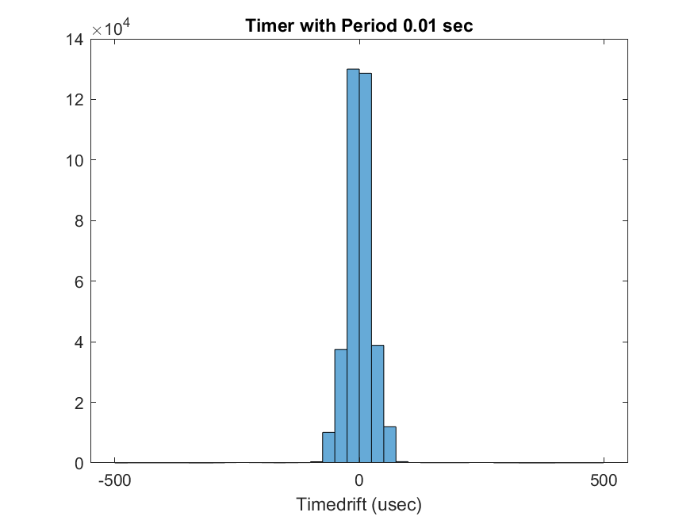

- **Stay-in time of a queue job**: the mean value is 80.44 μsec, the median value 80 μsec, the standard deviation 10.21, the minimum value 51 μsec and the maximum 676 μsec.
- **Producer time correction (timedrift)**: the mean value is 0.00 μsec, the median 0 μsec, the standard deviation 189.85, the minimum value -7486 μsec and the maximum 8020 μsec.
- **Processor usage** is ~ 4.22% and the program ran for 3600.006152 sec.

    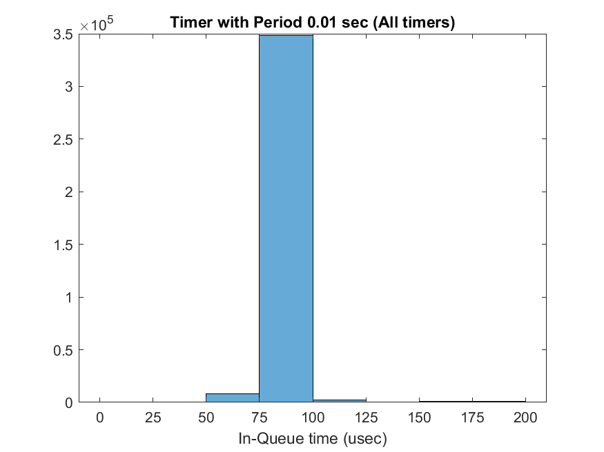 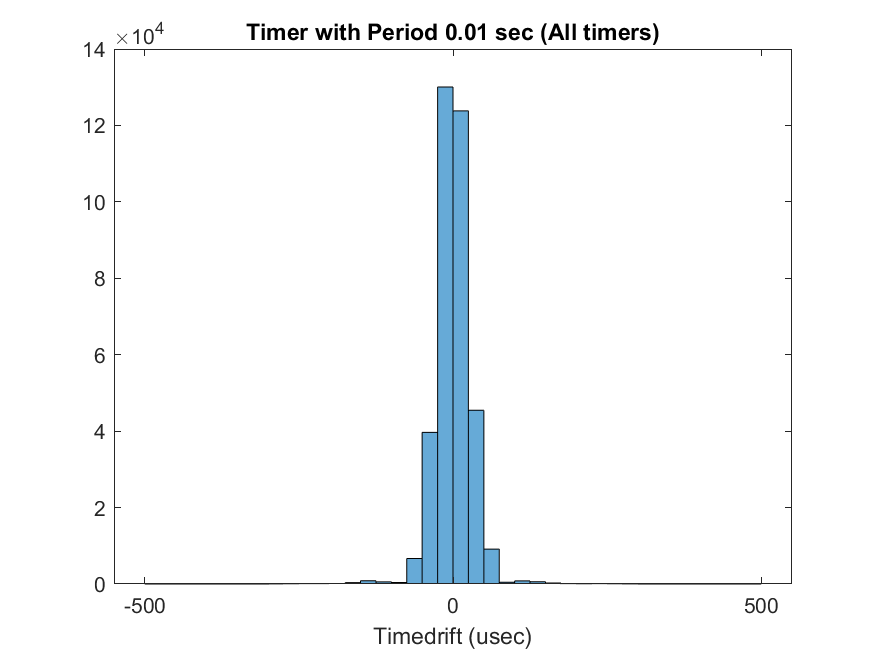

In the **simultaneous execution** of the timer with a period of 0.01 sec, the following statistics were measured:

- **Stay-in time of a queue job**: the mean value is 80.23 μsec, the median 80 μsec, the standard deviation 9.78, the minimum value 50 μsec and the maximum 670 μsec.
- **Producer time correction (timedrift)**: the average value is 0.00 μsec, the median value 0 μsec, the standard deviation 76.07, the minimum value -8277 μsec and the maximum 7155 μsec.

### 2.3. Conclusions

As mentioned, each timer starts a producer thread, while the consumer threads are always 10, as this achieves satisfactory results regarding the residence time of a job in the queue. Given one producer thread per timer, size 10 is used for the queue, since with this number it is not observed that the queue fills.

Normally, CPU usage increases, the shorter the timer period. The reason for this is that for a shorter period we have more work and therefore, the time that the CPU does some work to the consumer is longer. **CPU usage** is higher in the 4th experiment where the three timers run simultaneously, and specifically is **~ 4.7%**, while the run lasted 3600.010333 sec.

Another very useful conclusion that emerges from the above statistics is that the average value of timedrift is close to 0. This is a very logical conclusion, as timedrift expresses how much the time period in which the producer places jobs in the queue deviates from real period. This divergence is due both to the rest of the work done by the producer and to the inaccuracy of usleep. Therefore the timedrift gets both negative and positive values which, as the execution stabilizes, approach 0. With this time correction, the execution of the experiments is achieved to be about 3600 sec and we do not have unnecessary delays.

Finally, a final note is that the statistical quantities for each timer do not differ significantly in isolated and simultaneous execution. This is due to the parallelism between the threads, as one does not affect the other.